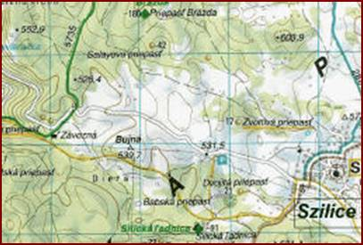
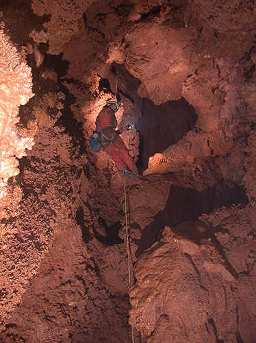
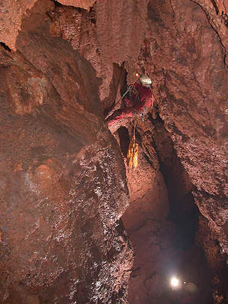
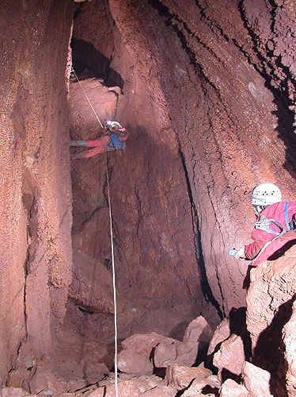
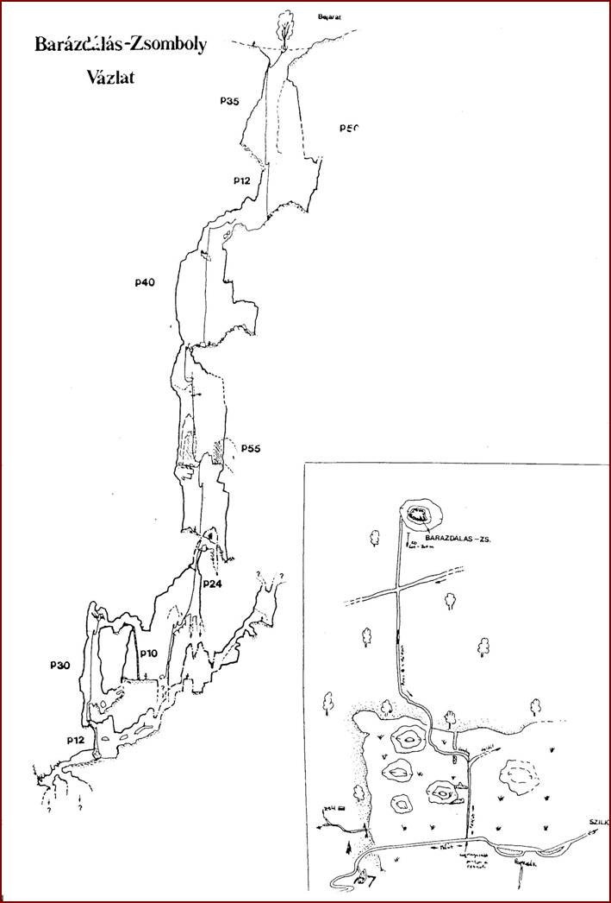
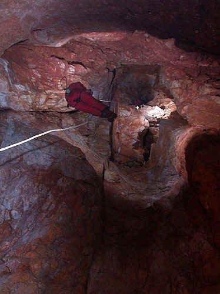
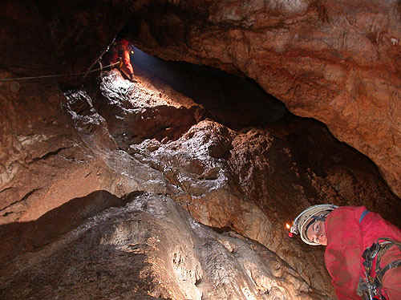

# Barázdálás-zsomboly

**Mélység:** −181 m  
**GPS:** 48° 34,2666′ N, 20° 29,6730′ E  
**Forrás:** <https://www.barlang.hu/pages/szlovakkarszt/brazda.htm>  
**Kapcsolódó írás:** *Gömör természeti öröksége 9. A Barazdálás*

## A barlang megközelítése

Gombaszög felől autóval felkapaszkodva a Szilicei-fennsíkra (lásd: térképvázlat), kb. 1,5–2 km-rel Szilice előtt, a műút legmagasabb pontjáról egy földút indul a fennsíki réten, a menetirány szerinti bal oldalon. Innen gyalog érdemes tovább indulni.

Mielőtt elérnénk az erdő szélét, az út kétfelé ágazik. Mi a bal oldali ágat követjük, amely kezdetben gyalogösvény, majd az erdő szélétől piros csík erdészeti jelzéssel van ellátva, és végig emelkedik. Mintegy 300–400 m után egy másik földút jön keresztbe, de mi egyenesen haladunk tovább körülbelül 100 m-t.

A barlang bejárata közvetlenül az út mellett fekszik. A barlang jellegében leginkább a Baglyok-szakadékához hasonlítható, bár beszerelése egyszerűbb. 180 méteres mélységével 1986-ban ez volt Szlovákia 7. legmélyebb barlangja.

## Beszerelés

### 1. akna

Beszállás a zsomboly meredek beszakadásának oldalában lévő fától. Innen egy kifeszített drótkötél vezet az első fix nittig.

Innen kb. 25 m ereszkedés után ferde, omladékos, földes lejtőre érkezünk, ahonnan egy széles, hosszú hasadék vezet tovább. Nitt (csN) a bal oldalon, fejmagasságban. Innen kb. 12 m ereszkedés.

**Szükséges kötél:** összesen kb. 50 m.

### 2. akna

Az előző akna beszállásától állva sétálhatunk a barlang legnagyobb aknájának beszállásához. A falon jobb oldalt fix szeg, illetve csN található. Bevezető szár, szintén a jobb oldalon, már bent csN, amit egy hosszabb kötélgyűrűvel a felette lévő oldásformáról lebiztosíthatunk.

Innen kb. 40 m ereszkedés következik megosztás nélkül.

**Szükséges kötél:** összesen kb. 45–50 m.

### 3. akna

A 2. akna aljától közvetlenül indul, kissé szűkebb beszállással (2 eN). Innen 8 m-t ereszkedhetünk egy szűkebb hasadékban. Itt párkány és csN található, majd 20 m kezdetben ferde ereszkedés következik; csak a végén válik függőlegessé.

Itt egy nagy párkány van oldalteremmel, amelyben szép cseppkövek és borsókövek találhatók. Az akna folytatásában jobboldalt eN, majd 4–5 m ferde ereszkedés után — ahol az akna függőlegessé válik — újabb eN található. Innen 10 m ereszkedés következik.

**Szükséges kötél:** összesen kb. 55 m.

### 4. akna

Az előző akna egy lejtős hasadékterembe vezet. Ebből, közel az aljához, jobb oldalt egy kis cseppköves oldalfülkéből egy szűkületen átpréselődve egy 2 m-es lemászás tetejére jutunk. Ennek alján találjuk a következő függőleges szakasz elejét.

Itt csN + Tk található, majd néhány méter ereszkedés után, ahol az akna tágul, elhúzás következik (Tk + kötélgyűrű). Innen 8 m ereszkedés, de nem kell az akna aljára lemenni, hanem 4–5 m-rel feljebb, egy nagyobb, omladékosabb párkány túloldalán 2 eN található, majd újabb 8–10 m ereszkedés következik.

Itt egy terembe érkezünk, amelynek túloldalán egy létrán felmászva haladhatunk tovább.

**Szükséges kötél:** összesen kb. 24 m.

### 5. akna

Tk az akna szájával ellenkező oldalon, a cseppkövek között, és egy eN a cseppkőlefolyás közepén, térdmagasságban. Innen kb. 15 m ereszkedés következik. A kötél felfekszik, ezért kötélvédő kell. Az aljáról egy szűk hasadékon további 5 m ereszkedés következik.

**Szükséges kötél:** kb. 30 m.

### 6. akna

Tk, majd bemászva, 2 m-rel lejjebb, a szemben lévő falon csN található. Innen 7 m ereszkedés következik.

**Szükséges kötél:** kb. 12 m.

Innen két irányba mehetünk tovább. Az egyik irány tovább lefelé vezet: kezdetben állva, majd négykézláb haladva egy szűk, hasadékjellegű akna beszállását érjük el. Itt mi még nem voltunk.

A kötél végétől a másik irányba, felfelé mászva a barlang további érdekes részeit tekinthetjük meg. Ha már az elején a Baglyok-szakadékához hasonlítottuk a barlangot, akkor ez a rész annak Szent-akna nevű részéhez hasonlítható.

Összefoglalva: a barlang — eltekintve egy-két aknabeszállástól — végig kényelmesnek mondható, és változatos túrázási lehetőséget biztosít.

---

**Nyerges Attila – Nyerges Miklós (1994)**

